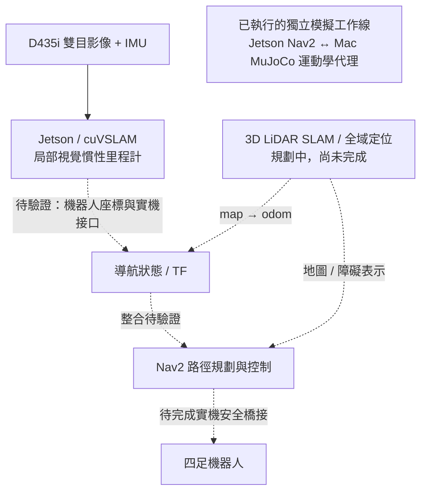

# 四足機器人導航與視覺慣性里程計研究
## Quadruped Navigation & Visual–Inertial Odometry Research

**研究者：Po-Chien Tseng**

本專案以四足機器人的自主導航為出發點，探討如何建立可觀測、可驗證的定位與導航系統。
由於四足平台沒有輪速計，本研究以 Intel RealSense D435i 的雙目影像與 IMU，
搭配 NVIDIA Jetson 上的 Isaac ROS cuVSLAM，建立局部視覺慣性里程計（odometry）來源。
另一方面，透過 Nav2 與 MuJoCo 運動學代理模型，研究路徑追蹤、靜態避障，以及動態目標預測與決策介面。

> **閱讀提示：** 此首頁是研究導覽。完整研究程式與新版目錄位於
> [研究分支](https://github.com/atanzoo/cuvslam_project/tree/codex/github-workstream-update-20261004/)，目前尚未合併至 `main`。
> 下方證據與程式連結皆指向研究分支；本專案尚未完成四足機器人實機自主導航驗收。
> 進度依截至 2026-10-02 的研究記錄整理；首頁於 2026-10-04 更新。

## 我的工作範圍

我的工作以專案整合、實驗設計與問題診斷為主，涵蓋感測器輸入、里程計驗證、監控工具與導航模擬：

- **感測器與估測系統整合：** 整理 Jetson／D435i 啟動流程，檢查雙目影像與 IMU、
  時間同步、CameraInfo、座標方向及 TF 發布者，建立可重複的資料輸入與量測流程。
- **里程計測試與故障分析：** 設計直線、轉彎與閉環路線，分析軌跡、追蹤狀態及影像品質；
  以模擬與受控 A/B 實驗釐清視覺觀測性、曝光與 IR projector 對結果的影響。
- **監控與證據保存：** 整合 macOS 網頁監控介面，呈現里程計、保留軌跡、IMU、
  品質診斷、過程記錄及測試摘要，使問題可追溯至相應資料。
- **導航模擬與研究介面：** 整合 Nav2／MuJoCo 橋接、地圖與路徑檢查、控制命令記錄及評估；
  探討 IMM 多模型運動預測、PPO 決策與 MPPI 控制器間的輸入契約。

本研究使用 NVIDIA cuVSLAM、ROS 2／Nav2、MuJoCo 與 Stable-Baselines3 等既有框架。
上述工作不代表我自行開發 cuVSLAM、Nav2 或 PPO 的原始演算法；
研究重點是系統整合、驗證方法、故障定位與可追溯的實驗流程。

## 系統架構與驗證邊界

以下為**目標整合架構**，不是已完成部署的實機系統。
相機里程計驗證與導航代理模擬目前維持獨立工作線；兩者之間的實機整合仍待驗證。

另有 A2M12 2D LiDAR、slam_toolbox 與 AMCL 的實驗建圖／定位工作線，
用於候選地圖與隔離診斷，不等同上圖規劃中的 3D LiDAR 實機整合。
LiDAR 里程計與 EKF shadow 亦保留為診斷研究，未取代目前 cuVSLAM 的正式局部里程計所有權。

## 代表成果與證據

| 項目 | 已記錄成果 | 適用範圍與限制 |
|---|---|---|
| 真實感測器里程計 | Jetson AGX Orin＋D435i 的 stereo／IMU 與約 30 Hz 里程計資料路徑；受測良好影像條件下，約 10 m 閉環路線的終點 XY 閉合殘差為 0.011–0.036 m | 這是閉合殘差，不是絕對定位精度；尚待機器人搭載、震動、速度與長時間測試 |
| Nav2 靜態路徑追蹤 | Jetson ROS 2 Humble 的 MPPI，搭配 Mac MuJoCo 運動學代理，在兩條指定靜態路線收到成功結果；兩次均無碰撞、地圖違規或超時 | 僅限該場景與兩條路線，非完整場景泛化、步態或實機安全驗收 |
| PPO 失敗模式分析 | 25,088 步 pilot 的 10 個配對測試中，碰撞由基準 4/10 降至 1/10，但超時由 1/10 升至 4/10，兩者成功率均為 0/10 | 未建立成功導航策略；保留地圖違規與等待行為問題，不能只以 reward 上升宣稱改善 |
| 動態互動介面 | IMM／PPO 與 Nav2 MPPI 的 G1 輸入契約已有 33 項聚焦單元測試驗證記錄 | G2 critic 建置／載入、G3 IMM 整合與 G4 策略接口尚未完成驗收 |

精選證據：

1. [實機里程計里程碑、運作條件與限制](https://github.com/atanzoo/cuvslam_project/blob/codex/github-workstream-update-20261004/PROJECT_HANDOFF.md#milestone-reached-real-cuvslam-odometry-accepted)
2. [MPPI 速度餘量診斷與兩條靜態路線結果](https://github.com/atanzoo/cuvslam_project/blob/codex/github-workstream-update-20261004/research/path_planning/NAV2_MPPI_BOUNDARY_GATE_COMMAND_HEADROOM_20261002.md)
3. [Nav2 RPP 單場景雙向路徑追蹤報告](https://github.com/atanzoo/cuvslam_project/blob/codex/github-workstream-update-20261004/simulation/path_planning/evidence/20261002_nav2_rpp_mujoco_fixed_gates.md)
4. [PPO pilot 的訓練趨勢與配對評估](https://github.com/atanzoo/cuvslam_project/blob/codex/github-workstream-update-20261004/simulation/path_planning/evidence/20260924_d1_max_proxy_map3_dual_target_ppo_25k.md)
5. [IMM／PPO／MPPI 接口設計與階段驗收](https://github.com/atanzoo/cuvslam_project/blob/codex/github-workstream-update-20261004/research/path_planning/NAV2_MPPI_PPO_IMM_INTERFACE_DESIGN_20261002.md)

## 主要研究目錄

| 目錄 | 內容 |
|---|---|
| [simulation/path_planning/](https://github.com/atanzoo/cuvslam_project/tree/codex/github-workstream-update-20261004/simulation/path_planning) | 四足模型、地圖、Nav2 橋接、導航模擬、訓練與評估 |
| [real_robot/cuvslam/](https://github.com/atanzoo/cuvslam_project/tree/codex/github-workstream-update-20261004/real_robot/cuvslam) | 真實 D435i 感測器啟動、校驗、里程計分析與監控工具 |
| [simulation/cuvslam/](https://github.com/atanzoo/cuvslam_project/tree/codex/github-workstream-update-20261004/simulation/cuvslam) | Gazebo／回放、感測器契約與視覺觀測性對照實驗 |
| [research/](https://github.com/atanzoo/cuvslam_project/tree/codex/github-workstream-update-20261004/research) | 研究假設、設計決策、實驗解讀與歷史研究記錄 |
| [shared/](https://github.com/atanzoo/cuvslam_project/tree/codex/github-workstream-update-20261004/shared) | Jetson 連線、共用設定範例與部署輔助 |
| [docs/](https://github.com/atanzoo/cuvslam_project/tree/codex/github-workstream-update-20261004/docs) | 文件索引、資料契約、操作流程及設計文件 |

各工作線的 `tools/` 保存程式與測試工具，`evidence/` 保存整理後的報告與證據。
候選地圖不代表已驗收的導航地圖；歷史報告以各自的環境與日期為準。
原始 bags、高量軌跡、模型 checkpoints、本機帳密及推甄文件不納入目前研究快照。

## 建議閱讀順序

- **快速了解研究：** 本頁 → 精選證據 → 感興趣的研究目錄。
- **深入查看程式：** [Nav2 模擬橋接](https://github.com/atanzoo/cuvslam_project/tree/codex/github-workstream-update-20261004/simulation/path_planning/nav2_map3)、
  [實機量測／監控工具](https://github.com/atanzoo/cuvslam_project/tree/codex/github-workstream-update-20261004/real_robot/cuvslam/tools)、
  [cuVSLAM 模擬分析工具](https://github.com/atanzoo/cuvslam_project/tree/codex/github-workstream-update-20261004/simulation/cuvslam/tools)。
- **後續開發或操作硬體：** 先讀
  [工程規範](https://github.com/atanzoo/cuvslam_project/blob/codex/github-workstream-update-20261004/ENGINEERING_GUIDELINES.md)、
  [主交接文件](https://github.com/atanzoo/cuvslam_project/blob/codex/github-workstream-update-20261004/PROJECT_HANDOFF.md)與
  [文件索引](https://github.com/atanzoo/cuvslam_project/blob/codex/github-workstream-update-20261004/docs/README.md)，不要把研究結果當成可直接操作機器人的指令。

## 重現與下一步

設定與環境流程以各工作線文件為準；本機連線值使用
`shared/config/local.env.example` 建立被 Git 忽略的本機設定。
主要依賴包含 ROS 2／Isaac ROS、RealSense、MuJoCo 與 Stable-Baselines3；
它們對應不同測試環境，並非同一份通用安裝流程。

[快照檢查記錄](https://github.com/atanzoo/cuvslam_project/blob/codex/github-workstream-update-20261004/docs/GITHUB_UPDATE_PREPARATION_20261003.md)記載：
188 個 Python 檔案通過 AST 檢查、15 個 shell／launcher 通過語法檢查；
37 個離線測試入口中 36 個通過，仍保留一項既有動態交會 decision-layer 失敗。
離線檢查不等同 ROS 執行、ARM64 建置或硬體驗收。

下一步聚焦於動態互動介面驗收、機器人搭載的里程計穩健性、
全域定位接口及安全控制橋接。尚未通過的門檻會持續公開記錄，不以模擬結果替代實機證據。

## 原始實驗輸出的歷史保存

為精簡公開目錄，`main` 最新版本不再附帶 24 個舊版原始日誌與 Gazebo pose dumps；
程式、測試、地圖及結論報告未因這次整理而刪除。本機原始資料保留，Git 歷史未重寫。
若歷史報告提到已移出的原始檔，可在
[整理前的完整版本](https://github.com/atanzoo/cuvslam_project/tree/c7eac6e17928eed453f2e93cc6ee5377d090cd3b)
按原路徑查看；這次清理不改變任何實驗成功／失敗結論。
